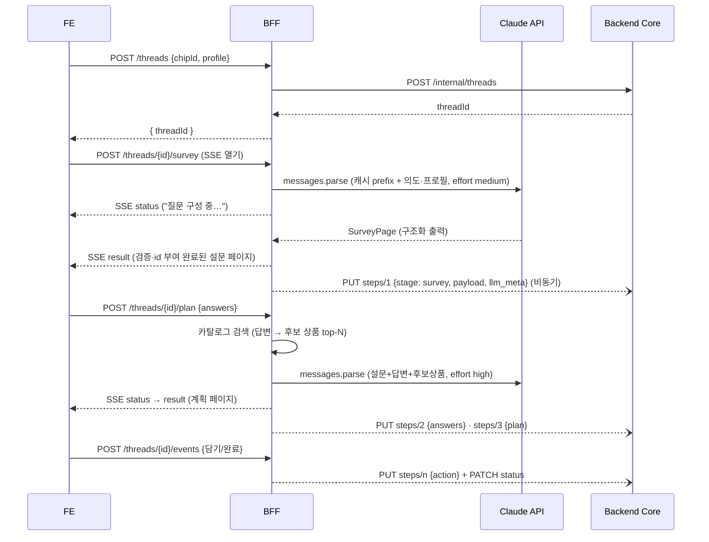

# DDAK 실서비스 설계 — LLM 기반 탐색·설문·계획 플로우

> 스튜디오(목업 도구)가 손으로 만들던 "설문→계획" 저니를 실제 LLM API가 실시간 생성하는
> 3계층 시스템 설계. 2026-08 초안.

## 0. 목표와 원칙

- **탐색 → 설문 → 계획** 플로우를 LLM이 사용자 의도·프로필·응답에 맞춰 실시간 생성한다.
- 3계층: **FE**(사용자 저니) / **BFF**(LLM + core 오케스트레이션) / **Backend Core**(쓰레드 저장·조회).
- 스튜디오는 버리는 게 아니라 **프롬프트·골든 케이스 저작 도구**로 승격된다.
  발행 시나리오·평가 데이터가 실서비스 프롬프트의 원천이 된다.

핵심 설계 결정 세 가지:

1. **UI DSL = 스튜디오 아이템 스키마.** LLM 출력은 `{ type, props }[]`
   (레지스트리 컴포넌트 15종의 서브셋)이고, FE는 스튜디오 Player/레지스트리 렌더러를 재사용한다.
   새 렌더 계층을 만들지 않는다.
2. **레이아웃은 코드가 소유, LLM은 콘텐츠만.** `lib/prompt/scenarioDraft.js`의 원칙 그대로 —
   id 발급·좌표·폭·정렬은 BFF 스캐폴드가 부여하고 LLM은 텍스트·질문·상품 배치만 결정한다.
3. **상품은 그라운딩.** LLM이 상품을 지어내지 않는다 — 카탈로그 검색 결과를 후보로 주입하고,
   응답의 상품 id를 허용 목록으로 대조 검증한다 (`revision.js`의 허용 목록 철학).

## 1. 전체 아키텍처

```
┌──────────┐  HTTPS(JSON) + SSE  ┌───────────────┐    REST(내부)   ┌──────────────┐
│    FE    │ ──────────────────▶ │      BFF      │ ─────────────▶ │ Backend Core │──▶ Postgres
│ (React)  │ ◀────────────────── │  (Node/TS)    │                │              │    (Neon)
└──────────┘                     │   │           │                └──────────────┘
                                 │   ▼           │
                                 │ Claude API    │◀── 프롬프트 팩 (스튜디오 발행물)
                                 │ 상품 검색 API │
                                 └───────────────┘
```

경계 원칙:

- FE는 **BFF만** 호출한다. core는 외부에 노출하지 않는다 (내부망/서비스 토큰).
- LLM API 키·프롬프트·모델 선택·검증은 전부 BFF 소관. **core는 LLM을 모른다**(LLM-agnostic) —
  LLM 관련 정보는 step의 `llm_meta` jsonb로만 흘러 들어온다.
- **쓰레드(core DB)가 유일한 원본.** BFF는 무상태(stateless)로 수평 확장 가능.
  이어보기·새로고침 복원은 전부 core 조회로 해결한다.

## 2. 데이터 계약

### 2-1. UI DSL (FE ↔ BFF 공유 스키마)

zod로 정의해 FE(렌더 전 검증)와 BFF(LLM 출력 검증)가 같은 패키지를 공유한다.

```ts
// packages/schema — 예시 (설문 페이지)
const SurveyItem = z.object({
  type: z.enum(['choiceQuestion', /* 설문 3종 + 공통 텍스트/안내 */]),
  props: z.object({ /* 컴포넌트별 — 레지스트리 fields[]에서 생성 */ }),
})
export const SurveyPage = z.object({
  intro: z.string(),                       // 페이지 머리 문구
  items: z.array(SurveyItem).min(3).max(5) // 질문 3~5개
})

// 계획 페이지
export const PlanPage = z.object({
  headline: z.string(),
  items: z.array(PlanItem),                // 계획 8종 + 공통 4종 서브셋
})
```

- 스키마의 컴포넌트 사양은 **레지스트리에서 추출**한다 — 스튜디오
  `lib/prompt/scenarioDb.js`가 이미 하는 일과 같은 원리라 코드를 공유할 수 있다.
- BFF는 LLM 출력(`{type, props}[]`)에 id·y좌표·폭을 부여해 스튜디오 아이템 형태
  `{ id, type, x, y, w, h: null, props }`로 완성한 뒤 FE에 준다. FE 렌더러는 수정 없이 동작.

### 2-2. 쓰레드 (core DB, Postgres)

스튜디오 `recordThread` 레코드와 필드를 정합시킨다 (이관·비교 가능하게).

```sql
threads (
  id uuid PK, user_id uuid, title text,
  source jsonb,          -- { kind: 'chip'|'search', chipId?, query? }
  status text,           -- exploring | surveying | planning | done | abandoned
  created_at, updated_at
)
thread_steps (
  id uuid PK, thread_id FK, seq int,
  stage text,            -- explore | survey | answers | plan | action
  payload jsonb,         -- 설문 정의 / 응답 / 계획 페이지 / 담기·완료 이벤트
  llm_meta jsonb,        -- { model, prompt_version, usage{input,output,cache_read}, latency_ms, fallback? }
  created_at,
  UNIQUE (thread_id, seq)  -- 멱등 upsert 키
)
```

- payload를 jsonb로 두는 이유: 스키마 진화가 빠른 초기라 정규화 최소화. 조회는 쓰레드 단위 aggregate.
- `llm_meta`는 비용·품질 대시보드의 원천 — 토큰·레이턴시·프롬프트 버전을 항상 기록.

## 3. Backend Core

**책임**: 쓰레드 CRUD + 목록/이어보기 조회. 그게 전부다 — 얇게 유지한다.

내부 API (BFF 전용, 서비스 토큰 인증):

| 메서드 | 경로 | 역할 |
|---|---|---|
| POST | `/internal/threads` | 쓰레드 생성 |
| PATCH | `/internal/threads/{id}` | status 등 갱신 |
| PUT | `/internal/threads/{id}/steps/{seq}` | 스텝 기록 (멱등 upsert) |
| GET | `/internal/threads/{id}` | 쓰레드 + 스텝 전체 (이어보기) |
| GET | `/internal/users/{uid}/threads?cursor=` | 목록 (요약 필드만, 커서 페이지네이션) |

- **스택**: **NestJS로 확정** (2026-08). Spring Boot Kotlin은 Vercel에 JVM 런타임이 없어 제외
  (컨테이너 이미지 경로는 가능하지만 5분 스케일다운 × JVM 콜드스타트가 부적합).
  배포는 같은 리포를 연결한 별도 Vercel 프로젝트(Root Directory=`apps/core`).
  DB는 Postgres — 스튜디오 미러링이 이미 쓰는 Neon을 초기에 그대로 써도 된다(스키마 분리).
- **기록은 비동기 + at-least-once**: BFF가 LLM 결과를 FE에 먼저 흘려보내고 core 기록은 후행.
  실패 시 재시도(인메모리 큐→추후 BullMQ 등). 사용자 경험이 기록에 블로킹되지 않는다.
  `(thread_id, seq)` upsert라 재시도가 중복을 만들지 않는다.

## 4. BFF

**책임**: 저니 오케스트레이션 — 쓰레드 시작, LLM 2회 호출(설문·계획), 카탈로그 그라운딩,
검증·폴백, core 기록.

### 4-1. 외부 API (FE 대상)

| 메서드 | 경로 | 역할 |
|---|---|---|
| POST | `/api/threads` | 저니 시작. `{ chipId?\|query, profile }` → `{ threadId }` |
| POST | `/api/threads/{id}/survey` | 설문 페이지 생성 (LLM #1). **SSE** |
| POST | `/api/threads/{id}/plan` | 응답 제출 → 계획 생성 (LLM #2). `{ answers }` **SSE** |
| POST | `/api/threads/{id}/events` | 담기/제외/완료 행동 기록 (fire-and-forget) |
| GET | `/api/threads/{id}` | 이어보기 — 생성된 설문/응답/계획 복원 |
| GET | `/api/threads` | 쓰레드 목록 (히스토리 패널) |

SSE 이벤트: `status`(생성 단계 진행 — "질문 구성 중…"), `result`(완성 페이지 JSON), `error`.

> v1은 `status` + `result`만. 아이템 단위 부분 스트리밍(`item` 이벤트)은 v2 —
> 구조화 출력의 부분 파싱이 필요해 복잡도가 크고, 설문/계획 페이지는 수 KB라
> 스켈레톤 → 통짜 렌더로도 체감이 충분하다.

### 4-2. LLM 호출 설계 (Claude API, TypeScript SDK)

```ts
import Anthropic from '@anthropic-ai/sdk'
import { zodOutputFormat } from '@anthropic-ai/sdk/helpers/zod'

const client = new Anthropic() // 키는 BFF 환경변수만

const response = await client.messages.parse({
  model: 'claude-opus-5',
  max_tokens: 16000,
  system: [
    // 안정 prefix: 시스템 프롬프트 + 컴포넌트 사양 + 톤 가이드 + few-shot(골든 케이스)
    { type: 'text', text: SYSTEM_PROMPT, cache_control: { type: 'ephemeral', ttl: '1h' } },
  ],
  output_config: {
    effort: 'medium',                      // 설문 = medium(응답속도), 계획 = high(품질)
    format: zodOutputFormat(SurveyPage),   // 구조화 출력 — 스키마 보장
  },
  messages: [{ role: 'user', content: buildSurveyRequest(intent, profile) }],
})

if (response.stop_reason === 'refusal') throw new LlmGenerationError(...) // content 읽기 전 반드시 체크 → 실패 안내
const page = response.parsed_output
```

결정 사항:

- **모델**: `claude-opus-5` 단일. 라우트별 차등은 모델 교체가 아니라 `output_config.effort`로 —
  설문 생성 `medium`(레이턴시 민감), 계획 생성 `high`(품질 민감). thinking 파라미터는 생략
  (opus-5는 생략 시 adaptive가 기본).
- **구조화 출력**: `client.messages.parse()` + `zodOutputFormat` — 응답이 스키마를 보장하므로
  JSON 건져내기 계층(`jsonAnswer.js`)이 필요 없어진다.
- **프롬프트 캐싱**: [시스템 프롬프트 + 컴포넌트 사양 + few-shot]은 모든 저니가 공유하는
  안정 prefix — `cache_control` 1h TTL. 가변부(프로필·답변·카탈로그)는 messages에.
  타임스탬프·요청 id를 system에 넣지 말 것(캐시 전면 무효).
- **refusal 처리**: opus-5는 안전 분류기가 `stop_reason: "refusal"`(HTTP 200)을 낼 수 있다.
  content 읽기 전 항상 체크. 서버측 폴백(`fallbacks: "default"`,
  beta `server-side-fallback-2026-07-01`) 옵트인을 권장 — 거절 시 같은 왕복 안에서
  대체 모델이 이어받는다.
- **타임아웃·재시도**: SDK 기본 재시도(429/5xx, 2회)에 맡기고 BFF 자체 상한(예: 60s).
- **실패 정책 (2026-08 확정)**: 최종 실패 시 가짜 맞춤 콘텐츠(폴백 템플릿)를 지어내지 않고
  **실패 안내**로 응답한다 — SSE `error` 이벤트 `{ code, message, retryable }` (API.md §1).
  강등 사다리(같은 검색어 성공본 캐시 재서빙 → 칩 저니의 스튜디오 발행 시나리오 폴백)는
  캐시 조회 인프라 마련 후 백로그.

### 4-3. 상품 그라운딩 (계획 생성)

1. 설문 답변 + 프로필로 검색 질의 구성 → **상품 검색 API**(사내 카탈로그) top-N 조회
2. 후보 목록을 프롬프트에 주입 — "이 목록의 상품만 사용, id 그대로" 지시
3. 응답 검증: 계획 아이템의 상품 id를 후보 목록과 대조. 벗어난 상품은 드롭하거나
   오류 명세를 붙여 1회 수리 재요청
4. v0 (카탈로그 API 연동 전): `lib/prompt/productSearch.js`의 정적 카탈로그 형식을
   프롬프트 팩에 포함시켜 대체

### 4-4. 검증 파이프라인

```
parse (zod 스키마)
  → 도메인 검증 (질문 수 3~5, 선택지 2~6, 상품 허용 목록, 필수 컴포넌트)
  → 실패 시 1회 수리 왕복 (오류 명세 포함 재요청)
  → 그래도 실패면 실패 안내 (SSE error — 가짜 콘텐츠로 대체하지 않는다)
```

### 4-5. 프롬프트 자산 — 스튜디오와의 관계

- **발행 시나리오 = 골든 케이스**: 스튜디오에서 발행한 stages/planCases를 JSON으로 내보내
  BFF 프롬프트 팩의 few-shot 예시로 쓴다. 잘 만든 시나리오가 곧 생성 품질 기준이 된다.
- **평가 데이터 = 회귀 테스트**: 평가 탭의 별점·피드백(리더보드 상위 케이스)을
  프롬프트 변경 시 품질 비교 기준으로 쓴다.
- **프롬프트는 버전 관리**: 팩을 파일로 리포에 두고 `prompt_version`을 `llm_meta`에 기록 —
  품질 변화를 버전 단위로 추적한다.

## 5. FE

- **렌더 계층 재사용**: 레지스트리(player 모드 렌더), Player의 스테퍼·프로필 배지·설문 요약·
  담기, ThreadPanel을 그대로 쓴다. 모노레포 패키지로 추출(`packages/ui-registry`)해
  스튜디오와 실서비스 FE가 공유하는 구성을 권장.
- **상태 머신**:
  `idle → journeyStarting → surveyLoading → surveyAnswering → planLoading → planViewing → done`
  (+ 어느 단계든 `error` → 재시도/폴백). 탐색은 스튜디오와 동일하게 정적 공통 페이지 —
  칩 클릭/검색이 곧 탐색 완료 신호다.
- **SSE 소비**: `status` 이벤트로 로딩 문구 갱신(스켈레톤), `result`로 페이지 렌더.
- **이어보기**: 쓰레드 패널 → `GET /api/threads/{id}` → 마지막 단계 복원.
- **데이터 프로필 확장**: 기존 `local`/`prod`(localStorage±미러링) 위에 `live`(BFF 호출) 모드를
  추가하면 목업 모드와 실서비스 모드가 한 코드베이스에서 토글된다 — 스튜디오는 저작·시연,
  live는 실서비스.

## 6. 시퀀스



## 7. 비기능 요구사항

- **인증**: v1은 익명 디바이스 id(서명 쿠키) → core user 매핑. 로그인 도입 시 병합 전략만 남겨둔다.
- **비용·레이트리밋**: 디바이스당 생성 횟수 제한(예: 시간당 N회), `llm_meta` 토큰 집계로
  일일 비용 대시보드·예산 알람. 프롬프트 캐싱 적중률(`usage.cache_read_input_tokens`) 모니터링 —
  0이면 prefix에 가변 바이트가 섞인 것.
- **관측성**: 요청 id를 FE→BFF→core로 전파. LLM 호출 로그에 threadId·prompt_version·usage·
  latency 구조화 기록. 검증 실패율·수리 왕복율·폴백율을 지표로.
- **보안**: API 키는 BFF 환경변수만, FE 번들에 절대 노출 금지. FE는 스튜디오 same-origin 경로
  (`/api/bff/*`)로만 호출 — 루트 `middleware.js`(엣지 미들웨어)가 `BFF_SERVICE_TOKEN`을 주입하고
  BFF가 ServiceTokenGuard로 검증한다(직접 URL 호출 차단). CORS(ALLOWED_ORIGINS)는 보조 방어.
  프로필(피부타입 등)은 PII 최소 수집 — 프롬프트 로그에 원문 저장 여부는 정책으로 결정.
- **SSE 인프라**: Vercel이면 Node runtime 스트리밍으로 가능. 자체 배포면 Fastify 권장.

## 8. 저장소 구성 제안

```
apps/
  studio/       # 스튜디오 (기존 scenario-studio — 모노레포 전환 완료, 2026-08). 실서비스 FE는
                # 여기서 진화(live 데이터 프로필)하거나 렌더 계층을 공유하는 신규 apps/fe로
  bff/          # Node/TS — Anthropic SDK, zod, SSE
  core/         # NestJS — 쓰레드 저장·조회 (별도 Vercel 프로젝트)
packages/
  schema/       # UI DSL zod + threads API 타입 (FE·BFF·core 공유)
  ui-registry/  # 레지스트리 렌더 컴포넌트 (스튜디오·FE 공유)
prompts/        # 프롬프트 팩 (버전 관리) — 스튜디오 발행물에서 생성
```

> 모노레포 전환(npm workspaces)·빌드 산출물 dist 이동·GitHub Pages Actions 전환은 완료됨.
> 배포는 "리포 1개 ↔ Vercel 프로젝트 N개" — 앱별 Root Directory + Ignored Build Step으로 독립 배포.

초기에 배포 단위를 줄이고 싶으면 core를 BFF 안의 모듈로 시작해도 된다 —
단, `/internal` API 경계와 저장 계층 분리는 처음부터 유지해서 분리 비용을 0에 가깝게.

## 9. 단계별 이행 로드맵

| 단계 | 내용 | LLM 사용 |
|---|---|---|
| **0. 계약 고정** | UI DSL zod 스키마 + threads API 확정. 목 BFF가 스튜디오 발행 시나리오를 planCases 평가 규칙으로 서빙 → FE 플로우·SSE·쓰레드 기록을 LLM 없이 먼저 완성 | 없음 |
| **1. 부분 생성** | 계획 페이지의 문구만 LLM 생성(레이아웃·상품·구조는 골든 케이스), 설문은 정적 | 저위험 |
| **2. 전체 생성** | 설문+계획 전체 LLM 생성, 카탈로그 그라운딩, 수리 왕복·폴백 완비 | 본격 |
| **3. 품질 루프** | 쓰레드 히스토리 기반 개인화, 스튜디오 평가 데이터를 프롬프트 회귀 테스트로, 부분 스트리밍(v2 SSE) | 고도화 |

0단계의 목 BFF는 버리는 코드가 아니다 — LLM 장애 시 폴백 경로이자, 골든 케이스 서빙 로직으로 계속 쓰인다.
