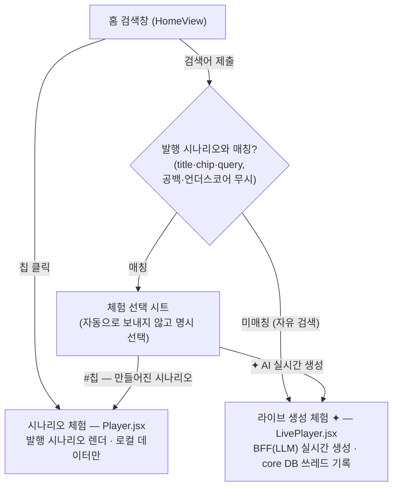
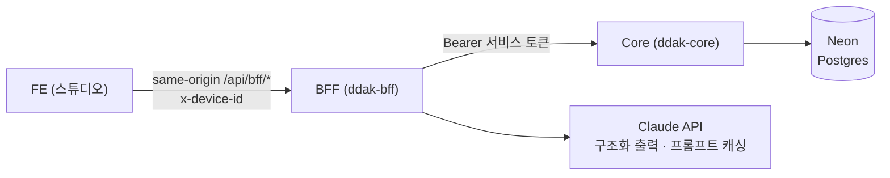
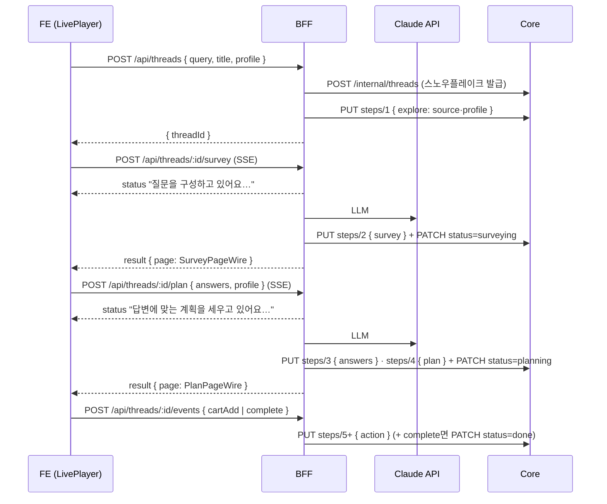

# DDAK 저니 플로우 — 검색 → 설문 → 계획

> 사용자 저니(검색/칩 진입 → 설문 → 계획 → 행동)의 단계별 컴포넌트·데이터 호출·모델과
> LLM 개입 위치, 쓰레드 CRUD, 두 체험 방식(시나리오/라이브), 관리 페이지를 한 문서로 정리한다.
> 계약의 단일 출처는 `packages/schema`(zod), 엔드포인트 상세는 [API.md](API.md),
> 설계 배경은 [DESIGN-LLM-SERVICE.md](DESIGN-LLM-SERVICE.md) 참고. (2026-08 기준)

## 0. 한눈에 보기



라이브 경로의 3계층 (FE는 BFF만 호출, core는 비공개):





## 1. 단계별 컴포넌트 · 데이터 호출 · 모델

단계 구분은 스튜디오 `STAGES`(설문 `survey` → 계획 `plan`)와 같다 — **탐색은 별도 단계 화면이
아니라 홈 그 자체**이고, 칩 클릭/검색 제출이 곧 탐색 완료 신호다.

### 1-1. 진입 — 홈 검색 / 칩 (탐색)

| 구분 | 내용 |
|---|---|
| 화면 | `HomeView.jsx` — 계정 소유 공통 탐색 페이지(`explore.items[]` 스택 렌더), 발행 칩은 `scenarioChips` 컴포넌트 자리 |
| 분기 | `submit()`: 검색어를 발행 시나리오의 title/chip/query와 매칭(공백·언더스코어 무시). **칩 클릭·매칭 히트 = 시나리오 체험**, 미매칭 자유 검색 = `api.playLive(q)` → 라이브 체험. 겹치면 자동으로 보내지 않고 **선택 시트**(`liveChoice`)로 명시 선택 |
| 호출(라이브) | `startLiveThread` → `POST /api/threads` `{ query, title, profile }` → `{ threadId }` |
| 저장 | core: `threads` 행 생성(status `exploring`) + 스텝 seq 1 `explore` `{ source, profile }`. source = `{ kind: 'chip'\|'search', chipId?, query? }` |
| 식별 | `x-device-id` 헤더 — `liveDeviceId()`가 localStorage `ddak-device-id`에 기기당 1회 발급 |

시나리오 체험은 이 단계에서 서버 호출이 없다 — `playScenario(id)`가 워크스페이스에서
시나리오 콘텐츠를 로드(`ensureScenarioSynced`)해 바로 Player로 간다.

### 1-2. 설문 단계

| 구분 | 시나리오 체험 (Player) | 라이브 체험 (LivePlayer) |
|---|---|---|
| 데이터 원천 | 발행 시나리오의 `stages.survey.items` (빌더 저작) | `POST /api/threads/:id/survey` **SSE** → `SurveyPageWire` (LLM #1) |
| 화면 컴포넌트 | 레지스트리 설문 3종 + 공통 (`surveyIntro`·`profilePanel`·`surveyQuestion` 등) | 같은 레지스트리 — `livePage.liveSurveyItems()`가 와이어를 아이템으로 투영 |
| 데이터 모델 | 스튜디오 아이템 `{ id, type, props, … }` | `SurveyPageWire = { intro, questions: [{ id, question, options[2..6], multi }] }` — BFF가 질문 id(`q1…qn`) 부여, **투영 아이템 id = 와이어 질문 id**라 answers 왕복에 재매핑 없음 |
| 응답 상태 | `answers[itemId]` (FE 메모리) | 동일 + 계획 요청 시 `[{ questionId, choices[] }]`로 직렬화 |
| 저장 | 워크스페이스 쓰레드(로컬)만 | core 스텝 seq 2 `survey` `{ page }` + `llmMeta`, 쓰레드 status → `surveying` |

### 1-3. 계획 단계

| 구분 | 시나리오 체험 | 라이브 체험 |
|---|---|---|
| 계획 결정 | **LLM 없음** — `resolvePlanCase(scenario, answers)`가 planCases 조건 평가(배열 순서 우선, 미일치 시 폴백 케이스) | `POST /api/threads/:id/plan` `{ answers, profile }` **SSE** → `PlanPageWire` (LLM #2, 카탈로그 그라운딩) |
| 화면 컴포넌트 | 케이스의 계획 아이템(계획 8종 + 공통) | `livePage.livePlanItems()` 투영: `planTitle` + `noticeCard`(summary) + `surveySummary` + guide→`planStep` / steps→`checklist` / products→`textBlock`(reason)+`hscroll`+`productCard`(자식, w 232, 이모지 목업) |
| 데이터 모델 | 시나리오 planCases | `PlanPageWire = { headline, summary, sections: guide\|products\|steps }` — products는 카탈로그 검증 통과분만 |
| 답변 변경 | 케이스 재평가(즉시) | **자동 재생성 안 함** — `planKey`(계획 생성 시점 답변 스냅샷)와 비교해 `planStale`이면 안내 바 + "✦ 계획 다시 생성" 버튼으로만 |
| 저장 | 워크스페이스 쓰레드만 | core 스텝 seq 3 `answers` + seq 4 `plan`(+`llmMeta`), status → `planning` |

### 1-4. 행동 · 완료

| 행동 | FE | 서버(라이브만) |
|---|---|---|
| 담기 | `addToCart` → 토스트 + cart 상태 | `POST /api/threads/:id/events` `{ type: 'cartAdd', data: { name } }` — **fire-and-forget**(실패해도 체험 안 막음) → 스텝 seq 5+ `action` |
| 완료 | `complete` → 홈 복귀 | `{ type: 'complete' }` → action 스텝 + status → `done` |
| 워크스페이스 기록 | 두 체험 모두 `api.recordThread` upsert (체험 1회 = 쓰레드 1개, 단계·답변·담기 변화마다 갱신). 라이브는 `live: true` 마커 | — |
| 이어보기 | 시나리오: 워크스페이스 기록에서 resume | 라이브: `GET /api/threads/:id` → `ThreadResumeWire`로 survey/answers/plan 복원 (설문이 없으면 이어서 생성) |

## 2. LLM 개입 위치

LLM 호출은 **BFF 단 두 곳**뿐이다 (`apps/bff/src/llm/llm.service.ts`). FE·core는 LLM을 모른다
— core에는 스텝의 `llm_meta` jsonb로만 흘러 들어온다.

| # | 위치 | 트리거 | effort | 입력 | 출력 스키마 |
|---|---|---|---|---|---|
| LLM #1 | 설문 생성 | `POST /threads/:id/survey` | `medium` (응답속도) | 의도(검색어/칩) + 프로필 | `SurveyGen` → `SurveyPageWire` |
| LLM #2 | 계획 생성 | `POST /threads/:id/plan` | `high` (품질) | 의도 + 설문 + 답변 + 프로필 + **카탈로그** | `PlanGen` → `PlanPageWire` |

호출 설계 (`llm.service.ts` · `prompts.ts`):

- **구조화 출력**: `client.messages.parse()` + `zodOutputFormat` — 스키마가 보장되므로 JSON 건져내기 계층이 없다.
- **프롬프트 캐싱**: 시스템 프롬프트(`SURVEY_SYSTEM`/`PLAN_SYSTEM`)는 바이트 고정 안정 prefix로 `cache_control` 1h. 가변부(의도·프로필·답변)는 user 메시지에만. `PROMPT_VERSION`(현재 `v1`)을 `llmMeta`에 기록.
- **모델 선택**: 기본 `claude-opus-5`. 런타임 모델은 core 설정 KV `llm-model`을 30s 캐시로 조회(관리 페이지가 변경, §5). effort 미지원 모델(haiku)은 `output_config.effort`를 빼고 호출.
- **카탈로그 그라운딩** (계획): `catalog.ts`의 정적 카탈로그를 시스템 프롬프트에 주입하고, 응답의 `productIds`를 `CATALOG_BY_ID` 허용 목록으로 대조 — 밖의 id는 드롭, 빈 products 섹션은 제거, 전 섹션이 사라지면 guide 폴백 섹션 하나(`threads.service.ts resolvePlan`).
- **실패 정책**: 가짜 맞춤 콘텐츠로 대체하지 않고 SSE `error` `{ code, message, retryable }`로 정직하게 안내 — `llm_not_configured`(키 없음, ✕) / `llm_refused`(안전 분류기 `stop_reason: refusal`, ✕ — 다른 검색어 유도) / `llm_failed`(호출·파싱 실패, ○ — SDK 자동 재시도 2회 후). FE는 retryable이면 "다시 시도", 발행 시나리오 폴백은 **사용자 클릭으로만**.
- **llmMeta**: `{ model, promptVersion, usage{inputTokens,outputTokens,cacheReadTokens}, latencyMs }` — 생성 스텝(2·4)에 붙는 비용·품질 대시보드의 원천.

**스튜디오 자체는 LLM API를 호출하지 않는다** — 빌더의 AI 기능(시나리오 만들기·조합 케이스·
문구 다듬기·페이지 재구성)은 전부 "프롬프트 복사 → 쓰던 AI에 붙여넣기 → 결과 가져오기"
왕복(`lib/prompt/`)이다. 실제 API 호출이 있는 곳은 라이브 체험의 BFF뿐이며, UI 표기도 가른다:
왕복은 `⇄`, 진짜 눌러서 생성되는 라이브는 `✦`.

## 3. 쓰레드 데이터 모델 · CRUD 플로우

**쓰레드(core DB)가 저니 1회의 유일한 원본**이다. 스키마(`apps/core/src/db/schema.ts`):

```
threads       id(text PK — 스노우플레이크 19자리) · user_id · title · source jsonb
              · status · created_at · updated_at
thread_steps  id(uuid) · thread_id FK(cascade) · seq int · stage · payload jsonb
              · llm_meta jsonb · created_at   — UNIQUE(thread_id, seq) = 멱등 upsert 키
settings      key PK · value jsonb · updated_at   — 운영 설정 KV (예: llm-model)
```

- **threadId = core 발급 스노우플레이크** (41b 타임스탬프|10b 워커|12b 시퀀스, 에포크 2010-01-01): 항상 19자리 십진 문자열이라 문자열 사전순 = 생성 시각순. 저장·와이어 모두 문자열.
- **status 전이**: `exploring → surveying → planning → done` (+`abandoned`, 관리 보관 `archived`). 단계 도착 = 상태 저장.
- **스텝 seq 규약** (BFF가 부여 — 이벤트 소싱 로그): 1 `explore` / 2 `survey` / 3 `answers` / 4 `plan` / 5+ `action`. 고정 순번이라 재시도·재생성이 같은 자리에 덮어써진다(멱등).

CRUD 흐름 (FE → BFF 공개 API → core internal API):

| 동작 | FE → BFF | BFF → Core | 비고 |
|---|---|---|---|
| **C**reate | `POST /api/threads` | `POST /internal/threads` + `PUT steps/1` | 시작 = 생성 + explore 스텝 |
| **R**ead (이어보기) | `GET /api/threads/:id` | `GET /internal/threads/:id` | 스텝을 `ThreadResumeWire`(survey/answers/plan)로 가공 |
| **R**ead (목록) | `GET /api/threads?cursor=` | `GET /internal/users/:uid/threads` | updatedAt 키셋 커서, **archived 제외** |
| **U**pdate (진행) | 설문/계획/이벤트 API의 부수 효과 | `PUT steps/:seq` + `PATCH /internal/threads/:id` | 스텝 upsert + status 갱신 |
| **U**pdate (보관) | admin `POST /api/admin/threads/:id/archive` | `PATCH` `status=archived` | §5 |
| **D**elete | **없음** | — | 보관이 소프트 삭제. 물리 삭제는 DB에서만(FK cascade) |

기록 신뢰성 규칙 (`threads.service.ts persist`): 스텝 기록 실패는 로그만 남기고 사용자 응답을
실패시키지 않는다 — 단 **fire-and-forget 금지**. Vercel 서버리스는 응답 종료 직후 실행을
동결하므로 응답 전에 `Promise.allSettled`로 완료를 기다린다(SSE status가 선행해 체감 지연 없음).

**워크스페이스 쓰레드(스튜디오 localStorage)는 별개 기록이다** — 두 체험 모두
`api.recordThread`로 `account:<id>:threads` 행에 upsert(추가형 로그라 서버 동기화 시 id 합집합
병합). 라이브 체험은 core 서버 기록과 워크스페이스 기록이 **이중**으로 남는다: 서버 기록이
복원의 원본(`GET /api/threads/:id`), 워크스페이스 기록은 ThreadPanel 목록·✦ 배지·시작 시각용.

## 4. 두 체험 — 시나리오 스튜디오 체험 vs LLM 라이브 체험

| | 시나리오 체험 (`Player.jsx`) | 라이브 생성 체험 (`LivePlayer.jsx`) |
|---|---|---|
| 진입 | 발행 칩 클릭, 매칭 검색어 (겹치면 선택 시트) | 홈 자유 검색 (미매칭 검색어) |
| 콘텐츠 | 빌더에서 저작·발행한 시나리오 (stages + planCases) | BFF의 LLM이 실시간 생성 (설문·계획) |
| 계획 결정 | `resolvePlanCase` — 답변 조건 평가로 케이스 선택 | LLM #2 + 카탈로그 그라운딩 |
| 서버 | 없음 (로컬 워크스페이스만) | BFF → core, 쓰레드가 Neon DB에 영속 |
| 로딩 연출 | 없음 (즉시 렌더) | SSE status + 스켈레톤 — **일부러 다르게 느껴지게** |
| 표기 | 칩 `#라벨` (✦ 없음) | `✦ AI 실시간 생성` 배지 상시, 쓰레드 ✦ 배지 |
| 실패 | 해당 없음 | 정직한 안내 + retryable 재시도. 발행 칩 폴백은 자동 강등이 아니라 사용자 클릭 |
| 답변 변경 | 계획 즉시 재평가 | `planStale` 안내 바 → 버튼으로만 재생성 |
| 이어보기 | 워크스페이스 기록에서 resume | `GET /api/threads/:id` 서버 복원 (runId 리마운트로 "새로 생성" 지원) |
| 렌더 계층 | 레지스트리 player 모드 | **동일** — `livePage.js` 투영으로 같은 레지스트리 재사용 (새 렌더 계층 없음) |

관계는 대체가 아니라 **승격**이다: 스튜디오는 프롬프트·골든 케이스 저작 도구로 남는다 —
발행 시나리오가 few-shot 예시, 평가 데이터가 회귀 테스트 기준이 되는 로드맵
(DESIGN-LLM-SERVICE.md §4-5). 라이브 실패 시 발행 시나리오가 폴백 후보로 제시되는 것도 같은 맥락.

경로 규칙: FE는 same-origin `/api/bff/*`만 부른다 — 배포는 루트 `middleware.js`(엣지)가 BFF로
rewrite + `BFF_SERVICE_TOKEN` 주입, 로컬은 vite 프록시(8788). GitHub Pages 등 교차 오리진은
스튜디오 Vercel 도메인으로 부른다 (`lib/liveApi.js`).

## 5. ADMIN 기능 (#admin)

진입은 스튜디오 **`#admin` 해시뿐** — 유저 UI에 링크가 없다 (`App.jsx` 라우트, `AdminView.jsx`).

인증은 **이중 가드**: ServiceTokenGuard(스튜디오 프록시 경유 강제) + AdminTokenGuard
(`x-admin-token` 헤더 = 사람이 아는 `ADMIN_TOKEN`). 토큰 미설정 시 프로덕션은 전부 401
(fail closed). 입력 토큰은 localStorage `ddak-admin-token`에 보관하고 401이면 폐기 후
게이트로 복귀 (`lib/adminApi.js`).

| 기능 | API | 동작 |
|---|---|---|
| 쓰레드 전체 목록 | `GET /api/admin/threads` | **archived 포함**, id(스노우플레이크) 키셋 커서 — 생성 최신순 |
| 라이프사이클 로그 | `GET /api/admin/threads/:id` | core `ThreadWithSteps` **원본**(llmMeta·action 포함) — 사용자용 이어보기와 달리 가공하지 않는다 |
| 보관 처리 | `POST /api/admin/threads/:id/archive` | `status=archived` — 데이터 보존, 사용자 목록에서만 숨김. 복구는 DB에서만 |
| LLM 모델 조회 | `GET /api/admin/model` | `{ current, defaultModel, configured, options[] }` — 카탈로그는 BFF `llm.service.ts` `MODEL_OPTIONS` 소유 (opus-5 기본 / sonnet-5 / opus-4.8 / haiku-4.5) |
| LLM 모델 변경 | `PUT /api/admin/model` | 카탈로그 밖 400, `null`이면 기본값 복귀. core `settings.llm-model`에 저장 — **새 생성부터 반영** (같은 인스턴스는 즉시 캐시 무효화, 다른 인스턴스는 TTL ≤30s) |

상세 화면은 `lib/adminReport.jsx`가 `ThreadWithSteps`를 **마크다운 문서로 생성**해 시각화한다
— 같은 마크다운 서브셋만 아는 미니 렌더러로 그리고, 복사 버튼이 원문을 그대로 쓰므로 생성기와
렌더러를 같이 유지한다. 스텝별로 stage·payload(설문 페이지, 답변, 계획 페이지, 행동)와
llmMeta(모델·토큰·지연)를 라이프사이클 순서로 보여줘 "이 쓰레드에 무슨 일이 있었는지"를
한 장으로 읽게 한다. 스타일은 `styles/admin.css`.
